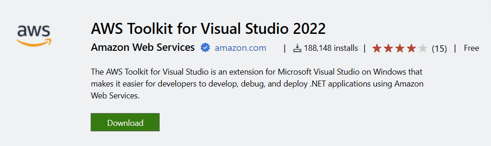
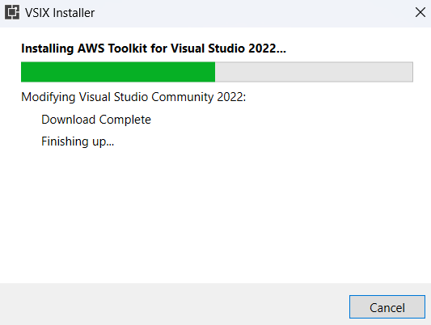
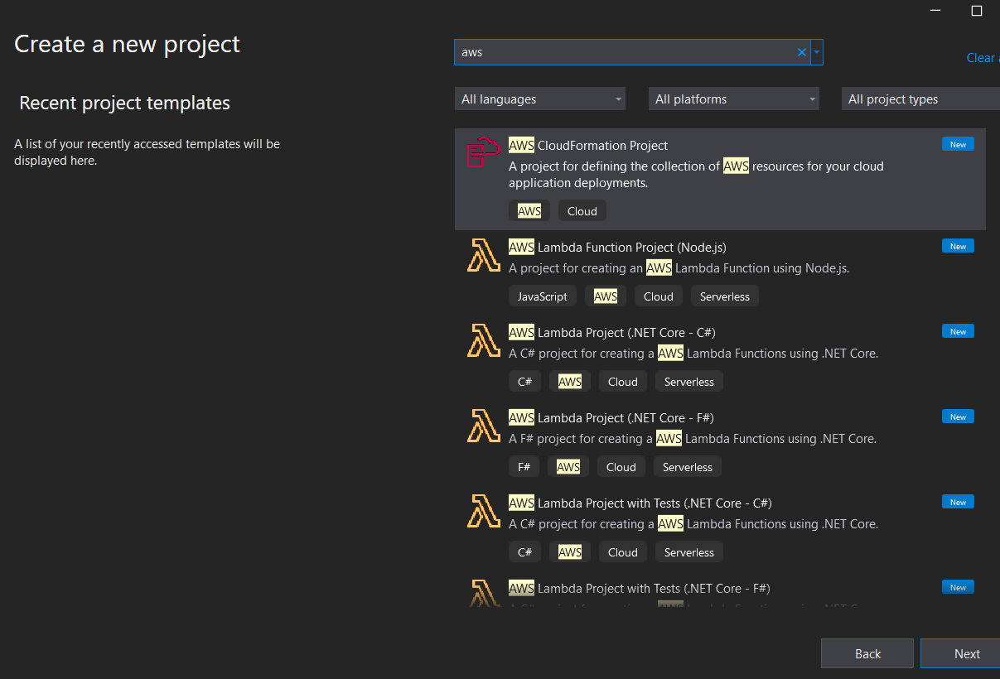
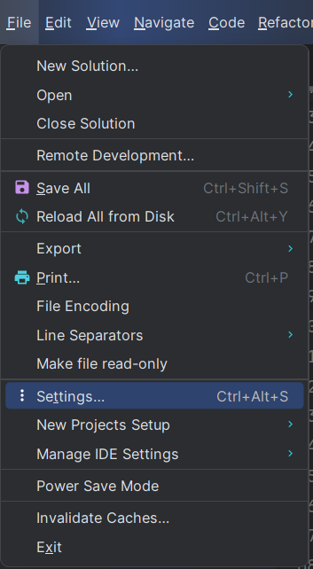
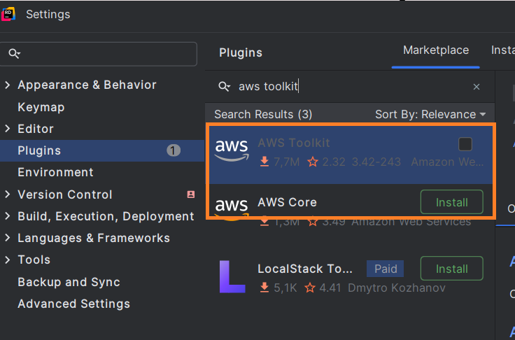

# Create C# Project

## Using CDK

Setup c# project within a empty folder with cdk tool

```bash
# create a project directory
mkdir projectname

# enter empty project folder
cd projectname

# create project
cdk init app --language csharp
```

## Using IDE

### Get templates

#### dotnet command

```bash
dotnet new -i  Amazon.Lambda.Templates
dotnet tool install -g  Amazon.Lambda.Tools

# To create project with .net we need these packages
dotnet add package Amazon.CDK
dotnet add package Amazon.CDK.AWS.S3
```

#### Visual Studio 2022

- [Download AWS toolkit for Visual Studio 2022](https://marketplace.visualstudio.com/items?itemName=AmazonWebServices.AWSToolkitforVisualStudio2022)
   
   
   

**1. Installer AWS Toolkit**

Først må du installere **AWS Toolkit for Visual Studio**:

1. Gå til **Extensions > Manage Extensions**.
2. Søk etter `AWS Toolkit for Visual Studio`.
3. Installer og start Visual Studio på nytt.

---

**2. Opprett et nytt prosjekt**

1. Gå til **File > New > Project**.
2. Velg prosjektmalen:
   - Søk etter **Class Library** eller **Console Application**.
   - Velg **Console Application** hvis du vil lage en selvstendig app.
3. Velg .NET-versjon (helst **.NET 6** eller nyere, som AWS CDK støtter).

---

**3. Legg til AWS CDK-pakker**
Etter å ha opprettet prosjektet:

1. Åpne **Package Manager Console** via:
   **Tools > NuGet Package Manager > Package Manager Console**.
2. Installer nødvendige CDK-pakker:

   ```powershell
   dotnet add package Amazon.CDK
   dotnet add package Amazon.CDK.AWS.S3
   ```

#### Rider

- **Installer AWS Toolkit**
  - Installer AWS Toolkit for Rider via Settings > Plugins > Marketplace, og søk etter AWS Toolkit.

    
    
- Opprett et nytt prosjekt
    1. Gå til File > New Project.
    2. Velg en .NET Core-prosjektmal, f.eks.:
        - Console Application: Hvis du ønsker en kjørbar applikasjon.
        - Class Library: Hvis prosjektet hovedsakelig er ment som et bibliotek for CDK-definisjoner.
- Legg til AWS CDK-pakker
Åpne Terminal i Rider.
  - Kjør følgende kommandoer for å legge til AWS CDK-pakker:

    ```bash
    dotnet add package Amazon.CDK
    dotnet add package Amazon.CDK.AWS.S3
    ```
