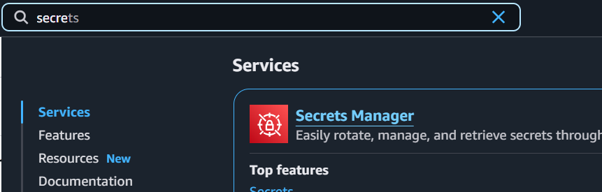
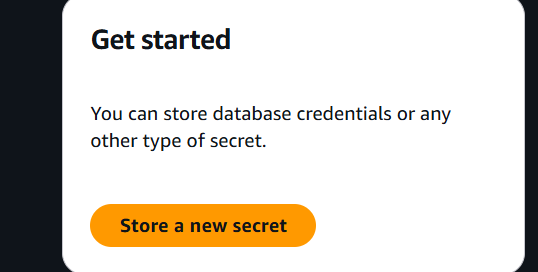
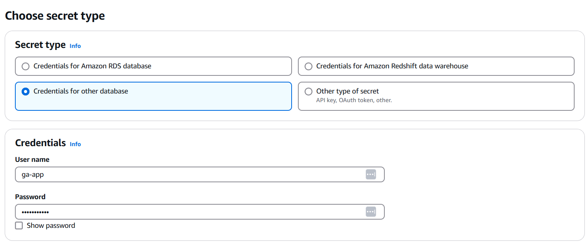
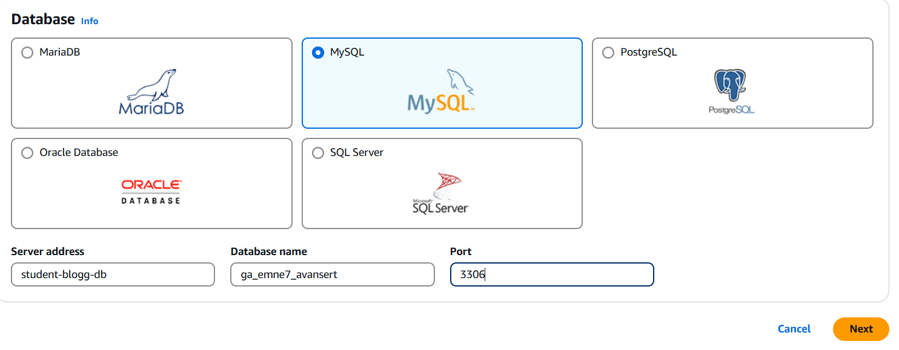
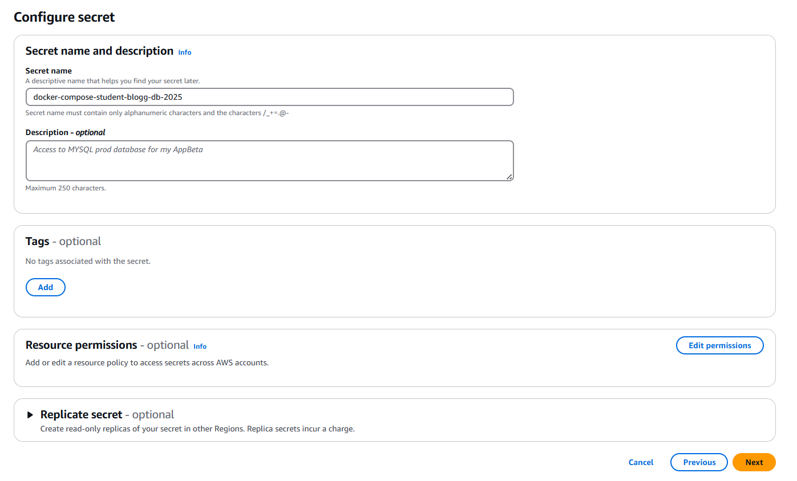
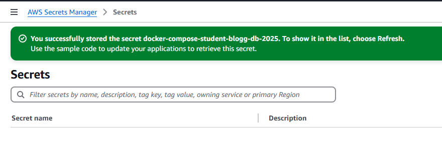

# AWS Secret Manager







Sample Code

```csharp
/*
 *	Use this code snippet in your app.
 *	If you need more information about configurations or implementing the sample code, visit the AWS docs:
 *	https://aws.amazon.com/developer/language/net/getting-started
 */

using Amazon;
using Amazon.SecretsManager;
using Amazon.SecretsManager.Model;

static async Task GetSecret()
{
    string secretName = "docker-compose-student-blogg-db-2025";
    string region = "eu-north-1";

    IAmazonSecretsManager client = new AmazonSecretsManagerClient(RegionEndpoint.GetBySystemName(region));

    GetSecretValueRequest request = new GetSecretValueRequest
    {
        SecretId = secretName,
        VersionStage = "AWSCURRENT", // VersionStage defaults to AWSCURRENT if unspecified.
    };

    GetSecretValueResponse response;

    try
    {
        response = await client.GetSecretValueAsync(request);
    }
    catch (Exception e)
    {
        // For a list of the exceptions thrown, see
        // https://docs.aws.amazon.com/secretsmanager/latest/apireference/API_GetSecretValue.html
        throw e;
    }

    string secret = response.SecretString;

    // Your code goes here
}
```




## Installer AWS SDK

```bash
dotnet add package AWSSDK.SecretsManager
dotnet add package AWSSDK.SecretsManager.Extensions.Caching
```
## Create Service Class

```csharp
using System;
using System.IO;
using System.Threading.Tasks;
using Amazon;
using Amazon.SecretsManager;
using Amazon.SecretsManager.Model;
using System.Text.Json;

public class AwsSecretsManagerService
{
    private readonly IAmazonSecretsManager _secretsManager;
    
    public AwsSecretsManagerService(IAmazonSecretsManager secretsManager)
    {
        _secretsManager = secretsManager;
    }

    public async Task<string> GetSecretAsync(string secretName)
    {
        try
        {
            var request = new GetSecretValueRequest
            {
                SecretId = secretName
            };

            var response = await _secretsManager.GetSecretValueAsync(request);

            if (response.SecretString != null)
            {
                return response.SecretString;
            }

            using var reader = new StreamReader(response.SecretBinary);
            return await reader.ReadToEndAsync();
        }
        catch (Exception ex)
        {
            Console.WriteLine($"Error retrieving secret: {ex.Message}");
            return null;
        }
    }

    public async Task<string> GetDatabaseConnectionStringAsync(string secretName)
    {
        string secretJson = await GetSecretAsync(secretName);

        if (string.IsNullOrEmpty(secretJson))
        {
            throw new Exception("Unable to retrieve database credentials from AWS Secrets Manager.");
        }

        var secretData = JsonSerializer.Deserialize<Dictionary<string, string>>(secretJson)
            ?? throw new NullReferenceException("Unable to retrieve database credentials from AWS Secrets Manager.");

        string connectionString = $"Server={secretData["host"]};" +
                                  $"Database={secretData["dbname"]};" + 
                                  $"User ID={secretData["username"]};" +
                                  $"Password={secretData["password"]};" +
                                  $"Port={secretData["port"]};";

        return connectionString;
    }
}

```

## Add program.cs

```csharp
using Amazon.SecretsManager;
using Microsoft.Extensions.DependencyInjection;

var builder = WebApplication.CreateBuilder(args);

// 🔹 La AWS SDK finne credentials automatisk (uten hardkoding)
IAmazonSecretsManager secretsManagerClient = new AmazonSecretsManagerClient();

// 🔹 Legg til AWS Secrets Manager i DI-containeren
builder.Services.AddSingleton<IAmazonSecretsManager>(secretsManagerClient);
builder.Services.AddSingleton<IAwsSecretsManagerService, AwsSecretsManagerService>();

// 🔹 Hent hemmeligheten før vi bygger videre
string? awsConnectionKey = builder.Configuration["AWS:SecretConnectionStringKey"] 
    ?? throw new ArgumentNullException("AWS:SecretConnectionStringKey missing in appsettings.json");
var secretsService = new AwsSecretsManagerService(secretsManagerClient);
var connectionStringFromAwsSecret = await secretsService.GetDatabaseConnectionStringAsync(awsConnectionKey) 
    ?? throw new ArgumentNullException("Kunne ikke hente hemmelighet fra AWS Secrets Manager");

builder.Services.AddDbContext<StudentBloggDbContext>(options =>
    options.UseMySql(connectionStringFromAwsSecret, ServerVersion.AutoDetect(connectionStringFromAwsSecret)));
```