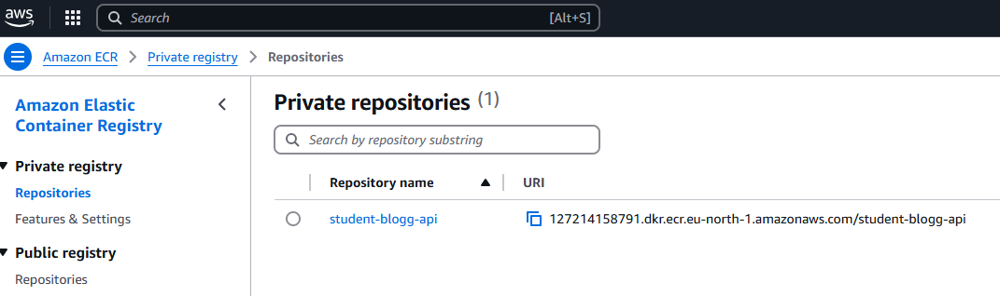
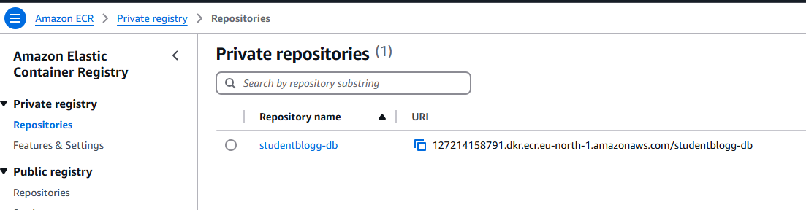
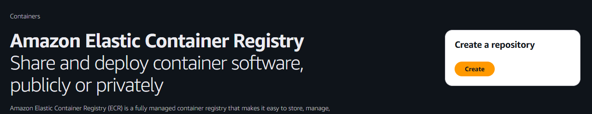
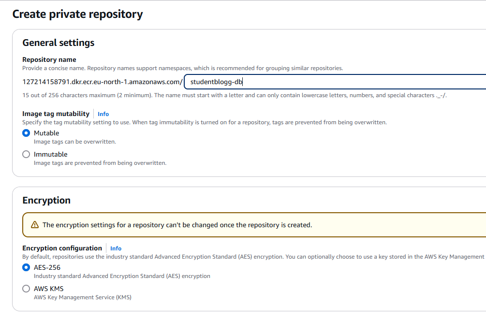
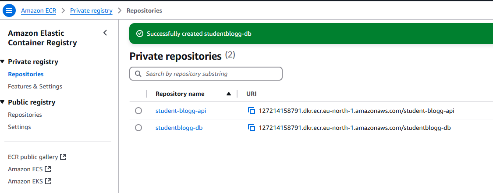
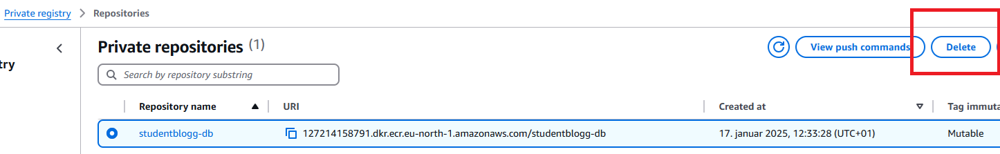
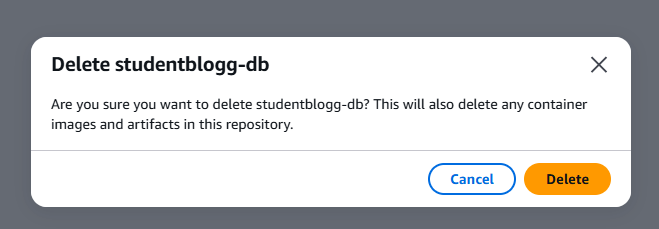
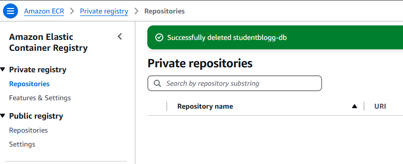

# ECR - Setup, Create and Delete Repository

## CLR

```bash
# create repository 
aws ecr create-repository --repository-name student-blogg-api

# response
{
    "repository": {
        "repositoryArn": "arn:aws:ecr:eu-north-1:127214158791:repository/student-blogg-api",
        "registryId": "127214158791",
        "repositoryName": "student-blogg-api",
        "repositoryUri": "127214158791.dkr.ecr.eu-north-1.amazonaws.com/student-blogg-api",
        "createdAt": "2025-01-17T12:30:53.770000+01:00",
        "imageTagMutability": "MUTABLE",
        "imageScanningConfiguration": {
            "scanOnPush": false
        },
        "encryptionConfiguration": {
            "encryptionType": "AES256"
        }
    }
}
```


<br><br><br><br><br><br><br><br><br>

```bash

# delete repository
aws ecr delete-repository --repository-name student-blogg-api --force

# response
{
    "repository": {
        "repositoryArn": "arn:aws:ecr:eu-north-1:127214158791:repository/student-blogg-api",
        "registryId": "127214158791",
        "repositoryName": "student-blogg-api",
        "repositoryUri": "127214158791.dkr.ecr.eu-north-1.amazonaws.com/student-blogg-api",
        "createdAt": "2025-01-17T12:30:53.770000+01:00",
        "imageTagMutability": "MUTABLE"
    }
}
```



---
<br><br><br><br><br><br><br><br><br><br><br><br><br><br><br><br><br><br>

## WEB

### Create Repository





### Delete Repository



