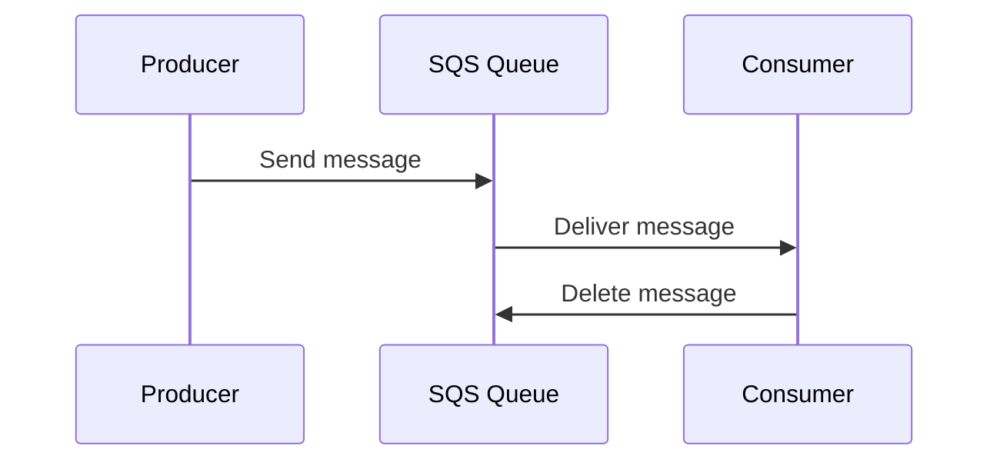

# AWS SQS - Simple Queue Service

## Hva er AWS SQS?

AWS Simple Queue Service (SQS) er en fullstendig administrert meldingskøtjeneste som muliggjør asynkron kommunikasjon mellom distribuert programvare. SQS gir en pålitelig, skalerbar og fleksibel løsning for meldingsutveksling mellom applikasjoner og mikrotjenester uten å kreve administrasjon av meldingssystemet.

### Egenskaper ved AWS SQS

- **Fullt administrert:** Du trenger ikke å sette opp eller administrere egen infrastruktur.
- **Skalerbart:** SQS håndterer dynamiske arbeidsmengder og kan skalere til millioner av meldinger per sekund.
- **Pålitelig:** Meldinger lagres redundantly på flere servere for å sikre høy tilgjengelighet.
- **Sikker:** Støtte for kryptering både i hvilemodus og i transit.

## Hva brukes AWS SQS til?

AWS SQS brukes til å:

1. **Koble mikrotjenester:** Gir løs kobling mellom ulike deler av et system, slik at hver tjeneste kan operere uavhengig.
2. **Køing av oppgaver:** Gir en mekanisme for å legge oppgaver i kø for asynkron behandling.
3. **Lastutjevning:** Distribuerer arbeidsmengden mellom flere instanser for å sikre balansert behandling.
4. **Redusere ventetid:** Gjør det mulig for applikasjoner å fortsette med andre oppgaver mens meldinger venter i køen på behandling.

## Typer av AWS SQS-køer

1. **Standard Queue:**
   - Tilbyr nesten ubegrenset gjennomstrømning.
   - Leverer meldinger minst én gang (mulig med duplikater).
   - Meldingsrekkefølge er ikke garantert.

2. **FIFO Queue (First-In-First-Out):**
   - Garanterer eksakt én leveranse av meldinger.
   - Opprettholder meldingsrekkefølge.
   - Brukes når rekkefølge er avgjørende.

## Nøkkelkomponenter i AWS SQS

1. **Meldinger:**
   - En melding er en enhet med data som sendes via køen.
   - Maksimal størrelse er 256 KB.
   - Kan inneholde tekst, JSON, XML, eller binærdata.

2. **Kø:**
   - En strukturert buffer for meldinger.
   - To typer køer: Standard og FIFO.

3. **Message Retention:**
   - Bestemmer hvor lenge meldinger blir værende i køen før de slettes (1 minutt til 14 dager, standard er 4 dager).

4. **Visibility Timeout:**
   - Et tidsvindu der en melding er usynlig for andre mottakere etter at den er hentet fra køen.
   - Hindrer duplikatbehandling.

5. **Dead Letter Queue (DLQ):**
   - En separat kø som fanger meldinger som ikke kan behandles vellykket etter flere forsøk.
   - Nyttig for feilhåndtering og debugging.

6. **Delay Queue:**
   - Forsinker levering av nye meldinger til køen med en definert periode (opptil 15 minutter).

7. **Access Control:**
   - Bruk AWS Identity and Access Management (IAM) for å kontrollere tilgang til køer.

## Hvordan SQS sammenligner seg med andre AWS-tjenester

- **SNS (Simple Notification Service):**
  - SNS brukes til å sende meldinger til mange abonnenter samtidig ("fan-out").
  - SQS brukes til køing og asynkron behandling av meldinger.

- **Amazon MQ:**
  - Amazon MQ er en administrert meldingstjeneste for applikasjoner som allerede bruker standarder som AMQP eller MQTT.
  - SQS er enklere og krever ikke spesiell protokoll.

## Typisk bruksmønster

- En produsent (Producer) sender meldinger til en SQS-kø.
- En eller flere konsumenter (Consumers) henter og behandler meldingene asynkront.
- DLQ håndterer feilmeldinger.

## Fordeler med AWS SQS

- Reduserer kompleksiteten i systemer.
- Øker skalerbarhet og robusthet.
- Reduserer risiko for systemfeil ved løs kobling av tjenester.

## Begrensninger

- Maksimal meldingstørrelse er 256 KB.
- Standard Queue tillater ikke strengt rekkefølge.

AWS SQS er et kraftig verktøy for å bygge skalerbare og pålitelige applikasjoner ved å løse problemer knyttet til meldingskøing og asynkron behandling.
